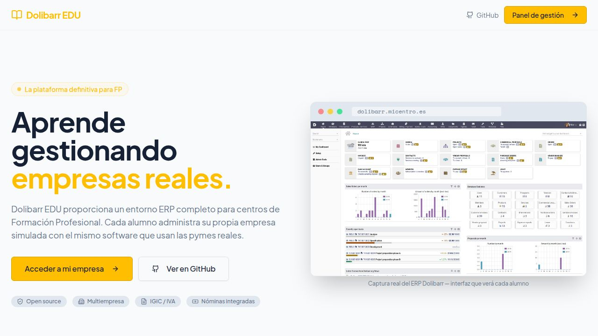
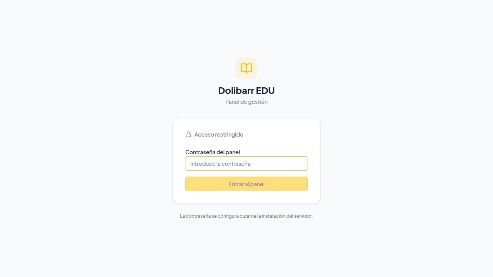

# ERP EDU


Plataforma de gestión educativa para centros de **Formación Profesional de Administración de Empresas**. Proporciona a cada alumno una empresa ERP real e independiente, con profesores gestionando grupos y alumnos desde un panel centralizado.

Un proyecto del **Departamento de Administración de empresas del IES Manuel Martín González**.

Desarrollado por **Atreyu Servicios Digitales (ASD)** · [GitHub](https://github.com/innovafpiesmmg/Dolibarr-Edu)

---

## Capturas de pantalla

### Página de inicio — acceso del alumno a su empresa


### Panel de gestión — acceso del profesorado


---

## Índice

1. [Descripción general](#descripción-general)
2. [Ecosistema de herramientas](#ecosistema-de-herramientas)
3. [Características](#características)
4. [Módulo NominasEDU (Dolibarr nativo)](#módulo-nominasedu-dolibarr-nativo)
5. [Arquitectura](#arquitectura)
6. [Instalación en servidor del centro](#instalación-en-servidor-del-centro)
7. [Configurar Cloudflare Tunnel](#configurar-cloudflare-tunnel)
8. [Actualización](#actualización)
9. [Configuración](#configuración)
10. [Panel de gestión — guía de uso](#panel-de-gestión--guía-de-uso)
11. [Portal del alumno](#portal-del-alumno)
12. [Desarrollo local](#desarrollo-local)
13. [Estructura del proyecto](#estructura-del-proyecto)
14. [API](#api)
15. [Seguridad](#seguridad)
16. [Tecnologías](#tecnologías)

---

## Descripción general

ERP EDU resuelve el principal reto de la FP de Administración: proporcionar a cada alumno un entorno de trabajo profesional real e independiente, sin licencias comerciales ni infraestructura compleja.

Cada alumno recibe en un único servidor:
- **Su empresa en Dolibarr ERP** — facturación, contabilidad, RRHH, inventario, CRM
- **Espacio en OpenProject** — gestión de proyectos con Gantt, tareas y registro de horas
- **Suite ofimática en el navegador** — Writer, Calc e Impress a través de Collabora Online

El profesorado gestiona grupos, alumnos, accesos y nóminas desde un panel web centralizado protegido con contraseña.

---

## Ecosistema de herramientas

ERP EDU despliega cuatro servicios en el mismo servidor, accesibles desde sus propios subdominios mediante un túnel Cloudflare:

| Servicio | Subdominio ejemplo | Función |
|---|---|---|
| **Panel EDU** | `panel.micentro.es` | Panel de gestión: profesores, grupos, alumnos, nóminas |
| **Dolibarr ERP/CRM** | `erp.micentro.es` | ERP multiempresa — una empresa por alumno |
| **OpenProject** | `proyectos.micentro.es` | Gestión de proyectos: Gantt, tareas, horas |
| **LibreOffice Online** | `office.micentro.es` | Suite ofimática en el navegador (Collabora) |

### Dolibarr ERP/CRM
El núcleo del sistema. Cada alumno opera una entidad Dolibarr completamente aislada con el mismo software que usan más de 250 000 pymes en todo el mundo. Incluye el **módulo PHP nativo NominasEDU** para prácticas de nóminas y Seguridad Social directamente dentro del ERP.

### OpenProject
Gestión de proyectos al nivel de herramientas profesionales como Jira o Monday. Los alumnos planifican tareas, registran horas y visualizan el progreso en diagramas de Gantt. Edición Community — completamente gratuita.

### LibreOffice Online (Collabora)
Suite ofimática completa en el navegador sin necesidad de instalar nada. Compatible con formatos .docx, .xlsx y .pptx.

---

## Características

### Panel de gestión
- **Dashboard** con estadísticas en tiempo real: total de profesores, grupos, alumnos y distribución por grupo
- **Gestión de profesores** — alta, edición y baja con conteo de grupos y alumnos asignados
- **Gestión de grupos** — CRUD completo con asignación de profesor responsable
- **Gestión de alumnos** — búsqueda, filtrado por grupo, alta, edición y baja
- **Exportar CSV** — descarga el listado completo de alumnos en formato Excel-compatible
- **Importación masiva** — carga de alumnos por CSV con resumen de errores
- **Restablecer contraseña** — genera una nueva contraseña para cualquier alumno y la sincroniza con Dolibarr

### Módulo de nóminas (panel Node.js)
- **Empleados** — vincula empleados del centro a alumnos para las prácticas de nóminas
- **Nueva nómina** — cálculo completo (salario bruto, IRPF, cuotas SS obrero/empresa con tipos 2024)
- **Detalle de nómina** — consulta y sincronización del asiento contable 640/642/465/476/4751 con Dolibarr HRM
- **Liquidaciones SS** — generación de RNT y RLC, asientos pago a Tesorería (476→572) y a Hacienda — Modelo 111 (4751→572)

### Sincronización con Dolibarr
- **Estado de sincronización** (`/estado`) — vista global con filtros por estado, botón de reintento e indicador de errores
- **Despliegue automático** — crea entidad empresa, usuario ERP y configura régimen fiscal (IGIC/IVA)

### Portal del alumno (landing page)
- Formulario de acceso con usuario y contraseña en la página pública
- Muestra nombre, empresa y grupo al autenticarse
- Acceso directo a la empresa en Dolibarr, a OpenProject y a LibreOffice Online

---

## Módulo NominasEDU (Dolibarr nativo)

**NominasEDU** es un módulo PHP real para Dolibarr. Aparece en el menú principal del ERP como cualquier otro módulo oficial y utiliza la interfaz y el estilo visual nativos de Dolibarr.

### Tipos SS aplicados (Régimen General 2024)

| Concepto | Obrero | Empresa |
|----------|--------|---------|
| Contingencias comunes | 4,70% | 23,60% |
| Desempleo | 1,55% | 5,50% |
| Formación profesional | 0,10% | 0,60% |
| FOGASA | — | 0,20% |
| MEI | 0,12% | 0,58% |
| **Total** | **6,47%** | **30,48%** |

### Instalación del módulo

El módulo se instala automáticamente con el despliegue. Para activarlo (una sola vez tras el primer arranque):
> **Dolibarr → Configuración → Módulos/Aplicaciones → pestaña Recursos humanos → NominasEDU → Activar**

---

## Arquitectura

```
Internet
   │
   ▼
Cloudflare Tunnel (HTTPS sin abrir puertos)
   │
   ├── panel.micentro.es      → panel_web   (nginx, puerto 8068)
   ├── erp.micentro.es        → dolibarr    (Apache PHP, puerto 8069)
   ├── proyectos.micentro.es  → openproject (Rails, puerto 8070)
   └── office.micentro.es     → collabora   (CODE, puerto 9980)
          │
          ▼
Servidor del centro (Ubuntu/Debian) — todos los servicios en Docker
   ├── panel_web      — Nginx sirviendo el frontend React + proxy /api
   ├── panel_api      — Node.js / Express (API REST)
   ├── panel_db       — PostgreSQL (BD del panel)
   ├── dolibarr       — Dolibarr ERP (módulo NominasEDU incluido)
   ├── db             — MariaDB (BD de Dolibarr)
   ├── openproject    — OpenProject (gestión de proyectos)
   ├── openproject_db — PostgreSQL (BD de OpenProject)
   ├── collabora      — Collabora Online / LibreOffice en el navegador
   └── cloudflared    — Cliente del túnel Cloudflare
```

**Modelo multi-empresa:** El módulo nativo `modMultiCompany` de Dolibarr aísla completamente cada empresa de alumno.

---

## Instalación en servidor del centro

### Requisitos previos
- Ubuntu 22.04 / Debian 12 (o compatible)
- Mínimo 4 GB de RAM (OpenProject es el servicio más exigente)
- Conexión a internet
- Dominio con DNS gestionado en Cloudflare

---

### Paso 0 — Preparar el servidor

Conéctate al servidor por SSH y ejecuta:

```bash
# Actualizar el sistema
sudo apt update && sudo apt upgrade -y

# Instalar git, curl y openssl (necesarios para el instalador)
sudo apt install -y git curl openssl

# Reiniciar si hubo actualizaciones del kernel (recomendado)
sudo reboot
```

Tras el reinicio, vuelve a conectarte por SSH. El instalador se encargará de instalar Docker automáticamente.

---

### Paso 1 — Instalación con un comando

```bash
curl -fsSL https://raw.githubusercontent.com/innovafpiesmmg/Dolibarr-Edu/main/install.sh | bash
```

El instalador realiza automáticamente:
1. Instala `git`, `curl`, `openssl` y Docker si faltan
2. Clona el repositorio en `/opt/dolibarr-edu`
3. Genera contraseñas aleatorias seguras para todos los servicios
4. **Solicita la contraseña** del panel de gestión
5. **Solicita los dominios** públicos de cada servicio
6. **Solicita el token de Cloudflare** (opcional — puedes añadirlo después)
7. Ofrece construir las imágenes del panel y arrancar todos los servicios

> El instalador es idempotente: si se interrumpe o ya existe una instalación parcial, volver a ejecutarlo retoma desde donde estaba sin borrar datos.

---

### Paso 2 — Configurar Cloudflare Tunnel

Ver la sección completa [Configurar Cloudflare Tunnel](#configurar-cloudflare-tunnel) más abajo.

---

### Paso 3 — Arrancar los servicios (si no lo hizo el instalador)

```bash
cd /opt/dolibarr-edu/dolibarr-edu

# Construir las imágenes del panel (solo la primera vez, ~5-10 min)
docker compose build panel_migrator panel_api panel_web

# Arrancar todo
docker compose up -d

# Comprobar que todos los contenedores están en marcha
docker compose ps
```

OpenProject tarda ~3 minutos en su primer arranque mientras ejecuta migraciones. Puedes seguirlo con:
```bash
docker compose logs -f openproject
# Ctrl+C cuando veas "listening on..."
```

---

### Paso 4 — Activar el módulo NominasEDU

Una sola vez, desde el navegador:
> **Dolibarr → Configuración → Módulos/Aplicaciones → pestaña Recursos humanos → NominasEDU → Activar**

---

### Paso 5 — Configuración inicial del entorno educativo

```bash
cd /opt/dolibarr-edu/dolibarr-edu
./scripts/setup-inicial.sh
```

---

## Configurar Cloudflare Tunnel

El túnel Cloudflare permite acceder a todos los servicios desde internet con HTTPS sin necesidad de abrir puertos en el cortafuegos del centro.

### Prerequisito: tener un dominio en Cloudflare

El dominio del centro (ej: `micentro.es`) debe estar gestionado por Cloudflare. Si no lo está, transfiere los nameservers del dominio a Cloudflare (gratuito).

---

### Paso A — Crear el túnel (una sola vez)

1. Entra en [dash.cloudflare.com](https://dash.cloudflare.com)
2. En el menú lateral: **Zero Trust → Networks → Tunnels**
3. Pulsa **Create a tunnel**
4. Elige **Cloudflared** y dale un nombre (ej: `dolibarr-edu`)
5. En la pantalla de instalación, copia el **token** que aparece en el comando:
   ```
   cloudflared service install eyJhIjoiMT...
   ```
   El token es la cadena larga que empieza por `eyJ`.

---

### Paso B — Guardar el token en el servidor

```bash
# Añadir el token al .env
echo "CLOUDFLARE_TOKEN=eyJhIjoiMT..." >> /opt/dolibarr-edu/dolibarr-edu/.env

# Reiniciar el contenedor del túnel
cd /opt/dolibarr-edu/dolibarr-edu
docker compose up -d cloudflared
docker compose logs cloudflared --tail=10
```

Cuando veas líneas con `Registered tunnel connection`, el túnel está activo.

---

### Paso C — Configurar los conectores (Public Hostnames)

En el dashboard de Cloudflare, una vez creado el túnel:

1. Ve a **Zero Trust → Networks → Tunnels**
2. Haz clic en tu túnel → **Edit**
3. Ve a la pestaña **Public Hostname**
4. Añade una entrada por cada servicio con **Add a public hostname**:

| Subdominio | Dominio | Servicio (URL interna) |
|---|---|---|
| `panel` | `micentro.es` | `http://panel_web:80` |
| `erp` | `micentro.es` | `http://dolibarr:80` |
| `proyectos` | `micentro.es` | `http://openproject:80` |
| `office` | `micentro.es` | `http://collabora:9980` |

> **Importante:** usa exactamente esos nombres de servicio (`panel_web`, `dolibarr`, `openproject`, `collabora`) — son los nombres internos Docker. Cloudflare los resuelve desde dentro del contenedor `cloudflared`, que está en la misma red Docker que el resto de servicios.

Cloudflare crea los registros DNS automáticamente al guardar cada hostname.

---

### Verificación del túnel

```bash
# Ver logs del túnel
docker compose logs cloudflared --tail=20

# Probar que Dolibarr responde localmente
curl -I http://localhost:8069

# Probar que el panel responde localmente
curl -I http://localhost:8068
```

---

## Actualización

```bash
curl -fsSL https://raw.githubusercontent.com/innovafpiesmmg/Dolibarr-Edu/main/update.sh | bash
```

El script de actualización:
1. Hace backup del `.env` actual
2. Descarga la última versión desde GitHub
3. Restaura la configuración
4. Reconstruye las imágenes del panel si hay cambios
5. Reinicia los contenedores

---

## Configuración

El archivo `.env` en `/opt/dolibarr-edu/dolibarr-edu/.env` contiene todas las variables. El instalador lo genera automáticamente.

### Dolibarr y base de datos

| Variable | Descripción |
|---|---|
| `MYSQL_ROOT_PASSWORD` | Contraseña root de MariaDB |
| `MYSQL_DATABASE` | Nombre de la base de datos de Dolibarr |
| `MYSQL_USER` / `MYSQL_PASSWORD` | Usuario de la base de datos |
| `DOLI_URL_ROOT` | URL pública de Dolibarr (ej: `https://erp.micentro.es`) |
| `DOLI_DOMAIN` | Dominio sin protocolo (ej: `erp.micentro.es`) |
| `DOLI_ADMIN_LOGIN` / `DOLI_ADMIN_PASSWORD` | Cuenta de superadmin de Dolibarr |
| `DOLI_COMPANY_NAME` | Nombre del centro (aparece en la cabecera del ERP) |
| `APP_PORT` | Puerto local de Dolibarr (por defecto `8069`) |

### OpenProject

| Variable | Descripción |
|---|---|
| `OP_HOST` | Dominio público de OpenProject |
| `OP_DB_PASSWORD` | Contraseña de la base de datos PostgreSQL |
| `OP_SECRET_KEY` | Clave secreta Rails |
| `OP_PORT` | Puerto local (por defecto `8070`) |

### Collabora Online

| Variable | Descripción |
|---|---|
| `COLLABORA_ADMIN` | Usuario del panel de admin de Collabora |
| `COLLABORA_PASSWORD` | Contraseña del panel de admin |
| `COLLABORA_PORT` | Puerto local (por defecto `9980`) |

### Panel EDU (Node.js)

| Variable | Descripción |
|---|---|
| `PANEL_URL` | URL pública del panel (ej: `https://panel.micentro.es`) |
| `PANEL_DB_PASSWORD` | Contraseña de la BD PostgreSQL exclusiva del panel |
| `ADMIN_PASSWORD_HASH` | Hash SHA-256 de la contraseña del panel (genera el instalador) |
| `SESSION_SECRET` | Clave secreta para firmar tokens de sesión |
| `DOLIBARR_BASE_URL` | URL pública de Dolibarr (igual que `DOLI_URL_ROOT`) |
| `PANEL_PORT` | Puerto local del panel web (por defecto `8068`) |

### Cloudflare

| Variable | Descripción |
|---|---|
| `CLOUDFLARE_TOKEN` | Token del túnel Cloudflare (ver sección [Configurar Cloudflare Tunnel](#configurar-cloudflare-tunnel)) |

### Cambiar la contraseña del panel

```bash
# Genera el nuevo hash SHA-256
echo -n "NuevaContraseña" | openssl dgst -sha256 | awk '{print $2}'

# Actualiza el .env
nano /opt/dolibarr-edu/dolibarr-edu/.env
# → Sustituye el valor de ADMIN_PASSWORD_HASH

# Reinicia el panel
docker compose restart panel_api
```

### Configuración fiscal

Desde el panel, en **Configuración**, puedes cambiar el régimen fiscal:
- **IGIC** (por defecto) — para centros de Canarias
- **IVA** — para centros de la Península y resto del territorio

El régimen se aplica únicamente al crear nuevas entidades.

---

## Panel de gestión — guía de uso

### Acceso
1. Navega a la URL del panel (ej: `https://panel.micentro.es`)
2. Pulsa **"Panel de gestión"** o ve directamente a `/login`
3. Introduce la contraseña configurada en la instalación

### Flujo de trabajo al inicio de curso

1. **Configura el régimen fiscal** — Ve a *Configuración* y comprueba IGIC o IVA
2. **Crea los profesores** — Ve a *Profesores → Nuevo profesor*
3. **Crea los grupos** — Ve a *Grupos → Nuevo grupo*, asigna un profesor
4. **Importa los alumnos** — Ve a *Importar* y pega el CSV del listado oficial
5. **Despliega las empresas** — En *Estado Dolibarr* pulsa *Desplegar* por alumno o en lote
6. **Activa NominasEDU** — En Dolibarr admin, activa el módulo (solo una vez)

### Formato CSV para importación masiva

```
nombre,apellidos,email,usuario,contraseña,empresa
Carlos,López Martín,carlos.lopez@alumnos.es,carlos.lopez,MiContraseña1!,Comercial López SL
María,Sánchez Ruiz,maria.sanchez@alumnos.es,maria.sanchez,MiContraseña2!,Asesoría Sánchez
```

---

## Portal del alumno

Los alumnos acceden desde la landing page del centro:

1. El alumno visita la URL del panel
2. En **"Accede a tu empresa"** introduce su usuario y contraseña
3. El sistema muestra su nombre, empresa y grupo
4. El botón **"Acceder a mi empresa"** abre directamente su entidad en Dolibarr

---

## Desarrollo local

### Requisitos
- Node.js 24+
- pnpm 9+
- PostgreSQL

### Configuración inicial

```bash
pnpm install
cp .env.example .env
# Edita .env con tu DATABASE_URL y SESSION_SECRET

pnpm --filter @workspace/db run push
pnpm --filter @workspace/api-spec run codegen
```

### Arrancar en modo desarrollo

```bash
# Terminal 1 — API server
pnpm --filter @workspace/api-server run dev

# Terminal 2 — Panel web
pnpm --filter @workspace/panel run dev
```

### Contraseña del panel en desarrollo

```bash
echo -n "admin123" | openssl dgst -sha256
# → 240be518fabd2724ddb6f04eeb1da5967448d7e831c08c8fa822809f74c720a9
```

### Comandos útiles

```bash
pnpm run typecheck                               # Verificación de tipos completa
pnpm run build                                   # Build de todos los paquetes
pnpm --filter @workspace/db run push             # Aplicar cambios de esquema DB
pnpm --filter @workspace/api-spec run codegen    # Regenerar hooks y schemas Zod
```

---

## Estructura del proyecto

```
dolibarr-edu/                        # Paquete de despliegue Docker
│   ├── docker-compose.yml           # Todos los servicios
│   ├── Dockerfile.api               # Build del API server Node.js
│   ├── Dockerfile.panel             # Build del frontend React (nginx)
│   ├── nginx-panel.conf             # Nginx: SPA + proxy /api
│   ├── .env.example                 # Plantilla de configuración
│   ├── install.sh                   # Instalador de un comando
│   ├── update.sh                    # Script de actualización
│   ├── cloudflare/config.yml        # Config del túnel (referencia)
│   ├── scripts/                     # CLI: setup-inicial, crear-grupo, etc.
│   └── modules/nominasedu/          # Módulo PHP nativo para Dolibarr
│
lib/
│   ├── api-spec/openapi.yaml        # Contrato OpenAPI (fuente de verdad)
│   ├── api-client-react/            # Hooks React Query generados por Orval
│   ├── api-zod/                     # Schemas Zod generados por Orval
│   └── db/src/schema/               # Tablas Drizzle ORM
│
artifacts/
│   ├── api-server/src/
│   │   ├── routes/                  # teachers, groups, students, auth,
│   │   │                            # deploy, employees, payrolls, ss, settings
│   │   └── lib/                     # dolibarr.ts, activity.ts, logger
│   └── panel/src/
│       ├── pages/                   # landing, dashboard, profesores, grupos,
│       │                            # alumnos, importar, nominas, configuracion
│       └── components/layout/       # Sidebar, AppLayout
```

---

## API

Base URL: `/api` · Especificación completa: `lib/api-spec/openapi.yaml`

| Método | Ruta | Descripción |
|---|---|---|
| `GET` | `/api/healthz` | Estado del servidor |
| `POST` | `/api/auth/login` | Login del panel |
| `POST` | `/api/auth/student-login` | Login del alumno |
| `GET/POST` | `/api/teachers` | Listar / crear profesores |
| `GET/PUT/DELETE` | `/api/teachers/:id` | Detalle, actualizar, eliminar |
| `GET/POST` | `/api/groups` | Listar / crear grupos |
| `GET/PUT/DELETE` | `/api/groups/:id` | Detalle, actualizar, eliminar |
| `GET/POST` | `/api/students` | Listar / crear alumnos |
| `POST` | `/api/students/bulk` | Importación masiva CSV |
| `GET/PUT/DELETE` | `/api/students/:id` | Detalle, actualizar, eliminar |
| `POST` | `/api/students/:id/deploy` | Crear empresa en Dolibarr |
| `GET/POST` | `/api/employees` | Empleados para nóminas |
| `GET/POST` | `/api/payrolls` | Nóminas |
| `GET` | `/api/ss` | Liquidaciones SS |

---

## Seguridad

- Las contraseñas de alumnos se almacenan como **hash SHA-256** (nunca en texto plano)
- El panel requiere autenticación con contraseña (hash SHA-256)
- Las sesiones usan `SESSION_SECRET` para firmado seguro
- Todos los servicios solo son accesibles desde **Cloudflare Tunnel** — no se expone ningún puerto al exterior
- Cada empresa Dolibarr está completamente aislada gracias a `modMultiCompany`

---

## Tecnologías

| Capa | Tecnología |
|---|---|
| **ERP** | Dolibarr 23+ (PHP) |
| **Proyectos** | OpenProject 15 (Rails) |
| **Ofimática** | Collabora Online / CODE |
| **Túnel** | Cloudflare Tunnel (cloudflared) |
| **API** | Node.js 24, Express 5, Drizzle ORM |
| **Frontend** | React 19, Vite, Tailwind CSS, shadcn/ui |
| **BD panel** | PostgreSQL 16 |
| **BD Dolibarr** | MariaDB 10.11 |
| **Contenedores** | Docker + Docker Compose |
| **Build** | esbuild (API), Vite (panel) |
